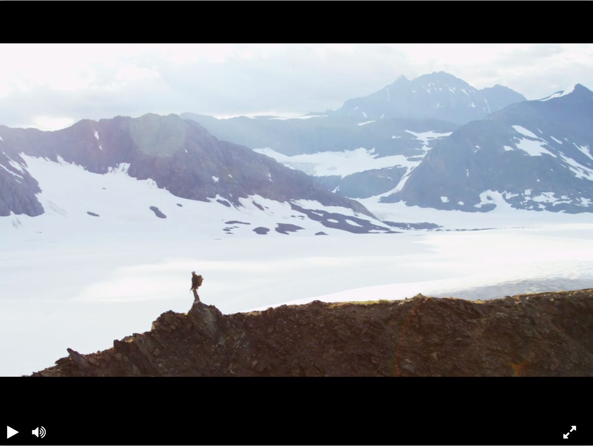

# Video player

This project is a video player with custom layout including play, pause, mute, fullscreen buttons and progress bar to control playback. It is built based on [this](https://github.com/devmanorg/video-player-jslib) JavaScript library.
For demonstration purposes it plays [this](https://dvmn.org/media/filer_public/78/db/78db3456-3fd3-4504-9ed9-d2d1fd843c0b/highest_peak.mp4) video which is preset in code.

### Preview

This project is available for preview on [GitHub Pages](https://pkzrnvch.github.io/video-player-layout/).

### Project Goals

The code is written for educational purposes on online-course for web-developers [Devman](https://dvmn.org).